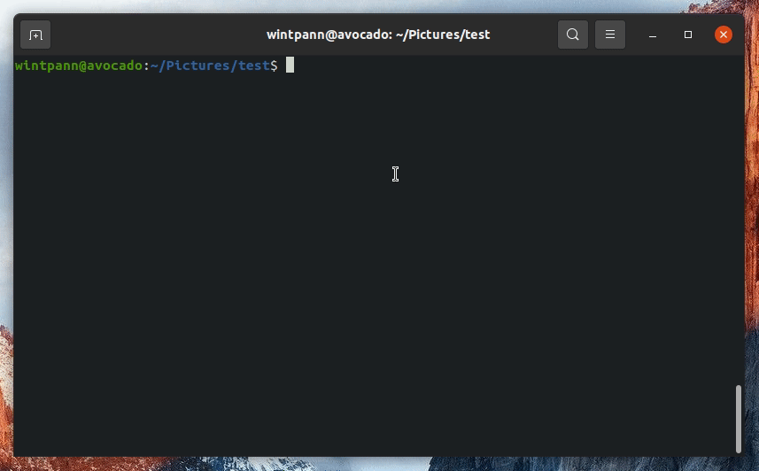

# Noderaft

Noderaft is the useful tool that allows you to store your js-things (drafts for example) in one place, group them and execute



### Installation

All you have to do to get it running is
1. Create a folder for your js-things `mkdir drafts`
1. Open that folder `cd drafts`
1. Initialize empty repo `npm init -y`
1. Install sandbox `npm install noderaft`

### Examples of usage

After you get prev step done, you can simply use it by 2 commands: `start` and `create`

```shell script
npx noderaft create examples1 functions arrays
```
> creates the file examples1.js with sections 'functions' and 'arrays'
---

```shell script
npx noderaft create examples2
```
> creates the file examples2.js with one 'main' section
---

```shell script
npx noderaft start examples1 functions arrays
```
> executes the file examples1.js with sections 'functions' and 'arrays'
---

```shell script
npx noderaft start examples2
```
> executes the file examples2.js with all its sections

### Helpers
You can use helpers, defined in global object like
```js
module.exports = {
  'section-example-1': () => {
    const instruction = 'execute your code here';
    white({ instruction });
    green('write logs in different colors');
    yellow('create as many sections as you need');
    black('section is just an object value (function to be executed)');
    red('object key used to determine different code sections');
    blue('comment here');
  },
  'my-custom-section': () => {
    green('separate module code to any sections as you want');

    divide('divide blocks to separate code in any section');
    empty();
    // shortcut for empty string
    yellow('explore objects in depth');
    const a = { b: { c: { d: { e: { f: { g: { h: 'basta' } } } } } } };
    red(a);
    green(depth(a));
  },
};

```